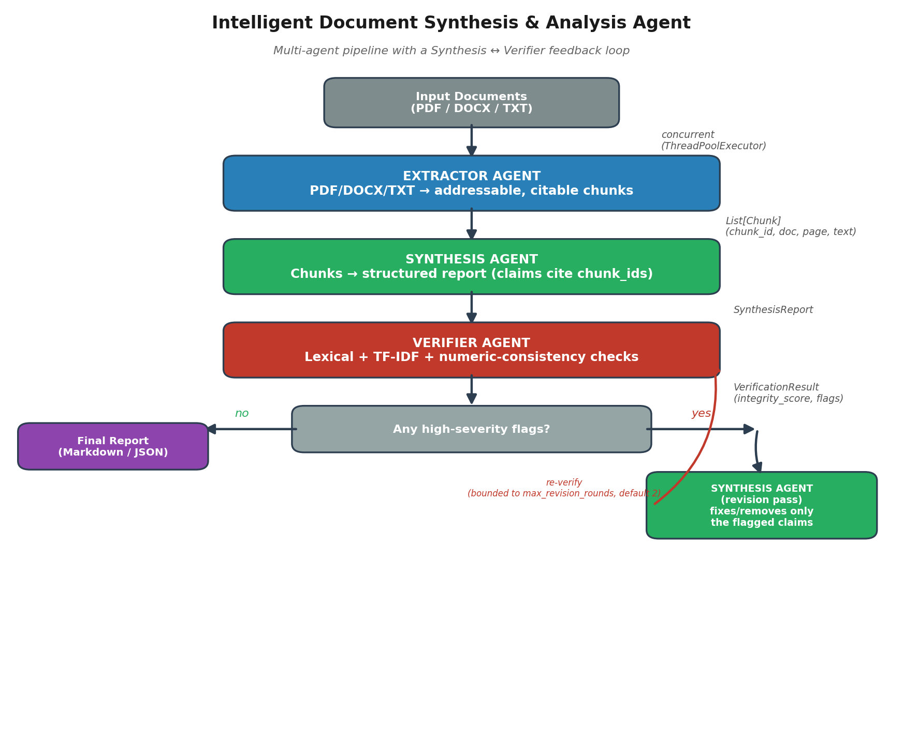

# Intelligent Document Synthesis & Analysis Agent

**Track C — 3SVK Convergence Season 2, AI Agent Track**

A multi-agent system that extracts, synthesizes, and verifies structured business
reports from unstructured technical/legal/business documents (PDF, DOCX, TXT).

## Why three agents, not two

The problem statement asks for an Extractor Agent and a Synthesis Agent, with the
core challenge of maintaining **data integrity throughout the transformation**.
Rather than just asserting integrity, this system enforces it structurally with a
third agent, and — critically — the agents actually talk to each other:

| Agent | Job |
|---|---|
| **Extractor Agent** | Pulls raw text from PDF/DOCX/TXT into addressable, citable chunks (each with a stable `chunk_id`, page/section metadata) |
| **Synthesis Agent** | Compiles chunks into a structured business report — every claim must cite the chunk_id(s) it came from. Also handles **revision**: when the Verifier flags a claim, the Synthesis Agent gets it back and rewrites, re-cites, or removes it |
| **Verifier Agent** | Independently checks every claim with three checks: (1) does the cited chunk exist, (2) lexical/TF-IDF similarity to the cited text, (3) do any dollar amounts, percentages, or figures in the claim actually appear in the source — this last check specifically catches fabricated numbers that would otherwise slip past a similarity check by sharing topical vocabulary. Flags get sent back to the Synthesis Agent for a bounded revision loop (default: up to 2 rounds) |

This turns "data integrity" from a design intention into something you can point to
in a demo: intentionally feed the Verifier a fabricated claim and watch the Synthesis
Agent get a chance to fix it, then get re-verified
(see `tests/test_pipeline.py::test_feedback_loop_resolves_fabricated_citation`).

## Three interfaces

| Interface | Use case | Run |
|---|---|---|
| **CLI** (`cli.py`) | Scripting, batch processing, CI | `python cli.py --input file.pdf --output report.md` |
| **Web UI** (`app.py`) | Live demo — watch the agents work | `streamlit run app.py` |
| **REST API** (`api.py`) | Programmatic / production use by other services | `uvicorn api:app --reload` → POST to `/analyze` |

### Docker

```bash
docker build -t doc-synthesis-agent .
docker run -p 8000:8000 doc-synthesis-agent
# then POST to http://localhost:8000/analyze, or override CMD:
docker run doc-synthesis-agent python cli.py --input sample_docs/sample_service_agreement.txt
```

### CI

Tests run automatically on every push via GitHub Actions (`.github/workflows/ci.yml`),
across Python 3.10/3.11/3.12, including a CLI smoke test in mock mode.

## Live demo UI

```bash
pip install -r requirements.txt
streamlit run app.py
```

Upload documents (or use the bundled sample), click **Run pipeline**, and watch all
three agents execute in sequence with live status updates — including the revision
loop firing in real time if the Verifier finds something. Built specifically so a
hackathon demo isn't "trust me, look at this terminal output."

## Architecture



<details>
<summary>Text version (for non-rendering viewers)</summary>

```
Input docs (PDF/DOCX/TXT)
        │
        ▼
┌─────────────────┐     concurrent (ThreadPoolExecutor)
│  Extractor Agent │ ──► List[Chunk] (chunk_id, doc, page/section, text)
└─────────────────┘
        │
        ▼
┌─────────────────┐
│  Synthesis Agent │ ──► SynthesisReport (claims cite chunk_ids)
│  (Claude API or  │
│   offline mock)  │
└─────────────────┘
        │
        ▼
┌─────────────────┐
│  Verifier Agent  │ ──► VerificationResult (integrity_score, flags)
└─────────────────┘
        │
        ├── no high-severity flags ──► final report
        │
        └── high-severity flags found
                    │
                    ▼
        ┌──────────────────────┐
        │ Synthesis Agent       │  revises flagged claims only,
        │ (refine pass)         │  leaves everything else untouched
        └──────────────────────┘
                    │
                    ▼
        Verifier Agent re-checks (bounded to max_revision_rounds, default 2)
                    │
                    ▼
             final report
```
</details>

## Quickstart

```bash
pip install -r requirements.txt

# Mock mode — no API key needed, fully offline, deterministic (good for demos)
python cli.py --input sample_docs/sample_service_agreement.txt --output outputs/report.md

# Multiple documents at once, mixed formats, processed concurrently
python cli.py --input sample_docs/*.txt sample_docs/*.pdf sample_docs/*.docx --output outputs/report.md

# Live mode — real LLM synthesis via Claude
export ANTHROPIC_API_KEY=sk-ant-...
python cli.py --input sample_docs/sample_service_agreement.txt --mode live --output outputs/report.md
```

Run the tests:
```bash
pip install pytest
python -m pytest tests/ -v
```

## Scalability

Don't take it on faith — run it yourself:

```bash
pip install reportlab  # only needed for generating benchmark PDFs
python benchmark.py --n-docs 40 --pages-per-doc 8 --worker-counts 1 2 4 8 16
```

Sample result on a 1-core sandbox (CPU-bound PDF parsing, so gains are capped by
available cores — expect a higher ceiling on a real multi-core machine):

```
Workers   Time (s)    Docs/sec    Speedup
--------------------------------------------
1         0.209       191.3       1.00x
2         0.133       301.8       1.58x
4         0.133       301.7       1.58x
8         0.130       308.4       1.61x
```

Other scalability notes:
- Extraction runs concurrently across all input documents via `ThreadPoolExecutor`
  (`--max-workers`, default 8).
- Each pipeline run prints a timing breakdown (extraction / synthesis / verification /
  revision / total) plus documents-processed and chunks-extracted counts, so
  throughput is directly observable on every run, not just in the benchmark script.
- Chunking caps chunk size (`MAX_CHUNK_CHARS`) so synthesis prompt size scales
  predictably with document count rather than ballooning per-document.
- The revision loop is bounded (`max_revision_rounds`, default 2) specifically so
  scaling to many flagged claims can't turn into unbounded re-synthesis cost.

## Data integrity mechanism, in detail

1. Every chunk gets a unique `chunk_id` at extraction time.
2. The Synthesis Agent's system prompt requires every claim to cite the `chunk_id`(s)
   it drew from, and explicitly instructs it to say "insufficient information" rather
   than invent content.
3. The Verifier Agent independently re-checks this after the fact, using three checks:
   - **Citation existence**: does the cited `chunk_id` actually exist? (catches hallucinated citations)
   - **Similarity** (lexical token overlap OR TF-IDF cosine similarity): does the
     cited chunk's text actually support the claim, allowing for legitimate paraphrasing?
   - **Numeric consistency**: do dollar amounts, percentages, and other figures in the
     claim actually appear in the cited source? This exists because of a real gap found
     during development — a fabricated claim can share enough surrounding vocabulary
     with the source to pass a pure similarity check while stating a completely wrong
     number (e.g. "$50,000 annually" instead of the source's "$18,500 monthly"). See
     `tests/test_pipeline.py::test_verifier_catches_swapped_figure_despite_topical_similarity`.
4. Flagged claims are sent back to the Synthesis Agent for a bounded revision pass
   (up to `max_revision_rounds`, default 2), then re-verified. If issues remain after
   the max rounds, they're surfaced in the final report under "⚠ Verifier Agent Flags"
   so a human reviewer sees exactly what to double check, with the reason why.

This is intentionally a fast, dependency-light approach (TF-IDF, not neural embeddings)
so it can run on every report with no model download and minimal added latency or cost.
Known limitation, stated plainly: the numeric-consistency check normalizes digit-form
numbers ("$18,500", "15%") but does not currently parse spelled-out numbers ("eighteen
thousand five hundred dollars") — a fabrication using spelled-out figures could slip
through. Swapping in a neural embedding model (e.g. `sentence-transformers`) or adding
a number-word parser are both documented, scoped extensions rather than silent gaps.

## Project structure

```
.
├── cli.py                  # CLI entry point
├── app.py                  # Streamlit visual demo UI
├── api.py                  # FastAPI REST service
├── benchmark.py            # scalability benchmark (real numbers, not claims)
├── Dockerfile / .dockerignore
├── LICENSE                 # MIT
├── .github/workflows/ci.yml  # runs tests on every push (Python 3.10/3.11/3.12)
├── assets/architecture.png
├── src/
│   ├── models.py           # shared Pydantic schemas (Chunk, SynthesisReport, etc.)
│   ├── extractor_agent.py  # PDF/DOCX/TXT -> Chunks
│   ├── synthesis_agent.py  # Chunks -> SynthesisReport (live via Claude w/ retries, or mock w/ extractive summarization); refine() for revision pass
│   ├── verifier_agent.py   # SynthesisReport + Chunks -> VerificationResult (3 checks)
│   ├── orchestrator.py     # coordinates all three agents, concurrency, revision loop
│   └── report_writer.py    # renders final Markdown report
├── sample_docs/            # demo documents (service agreement, invoice, addendum)
├── tests/test_pipeline.py  # 10 unit tests, including adversarial/regression tests
├── outputs/                # generated reports land here
└── requirements.txt
```

## Known limitations / next steps

- PDF extraction is text-layer based (PyMuPDF); scanned/image-only PDFs need an OCR
  step (e.g. Tesseract) which isn't wired in yet — the Extractor Agent already
  surfaces a warning when a page has no extractable text, so this failure mode is at
  least visible rather than silent.
- The Verifier's numeric-consistency check doesn't parse spelled-out numbers (see
  "Data integrity mechanism" above for detail on this specific, tested limitation).
- Synthesis currently processes all chunks in a single LLM call; for very large
  document sets this should be chunked into multiple calls with a final
  merge/reduce step.
- The Dockerfile follows standard practice but hasn't been build-tested in this
  environment (no Docker daemon available in the sandbox this was built in) —
  run `docker build .` once yourself before relying on it for a live demo.
- `api.py` has no authentication/rate-limiting — fine for a hackathon demo or
  internal use, but would need an API key or gateway in front of it for real
  production exposure.
